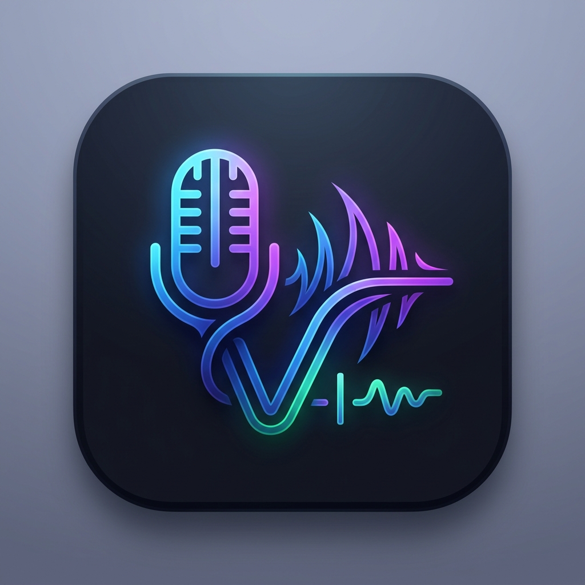

# 🎙️ VoiceType — Real-time AI Voice Typing for Windows

<p align="center">
  
</p>

<p align="center">
  <strong>Fast, accurate, and seamless real-time voice-to-text for Windows powered by Google Gemini Live WebSocket API.</strong>
</p>

<p align="center">
  
  
  
  
  
  <a href="https://github.com/Sirawit-Thong/VoiceType/releases/latest">
    
  </a>
</p>

---

## ✨ Features

### ⚡ Real-Time Streaming Speech Recognition
* **Gemini Live WebSocket Engine**: Streams raw PCM audio in real-time with sub-second transcription response.
* **Fast Mode**: Instantly injects transcribed text with zero latency directly into any active application (Chrome, VS Code, Discord, Word, Line, Notion, etc.).

### 💊 Modern Dynamic Capsule Floating UI
* **Dynamic Pill Style**: An elegant floating capsule widget with a live animated audio visualizer.
* **Ultra-Minimal Dot Style**: A tiny discreet circle that expands automatically on hover or speech.
* **Customizable Opacity & Placement**: Draggable anywhere on the screen with position memory and adjustable transparency.

### 🎮 Keyboard & Mouse Button Triggers
* **Push-to-Talk Mode**: Hold the key or mouse button while speaking; text is automatically typed upon release.
* **Toggle Mode**: Click or press once to start listening, and press again to finish.
* **Supported Inputs**:
  * ⌨️ **Function Keys**: F6, F7, F8, F9, F10, F11, F12
  * ⌨️ **Keyboard Keys**: Caps Lock, Scroll Lock, Insert, Home, End
  * 🖱️ **Mouse Side Buttons** (Back / Forward / XButton 1 & 2)
  * 🖱️ **Mouse Middle Click** (Scroll Wheel Click)
  * 🎯 **One-Click Input Capture**: Detects and binds any key or mouse button in Settings.

### 🇹🇭 Strict Dual-Language Support (Thai & English)
* **Thai (ภาษาไทย)**: Strict Thai mode ensures pure Thai output without accidental English phonetic mixing.
* **English**: Strict English transcription.
* **Auto (Thai + English)**: Automatically detects and switches between Thai and English.
* **Quick Switcher**: Change languages instantly from the floating capsule menu (`⋯`), System Tray, or Settings.

### ⚙️ Rich Settings & Utility Suite
* **Custom Vocabulary**: Add domain-specific terms, technical keywords, or proper nouns to improve AI accuracy.
* **Live Mic Audio Level Meter**: Test and visualize input levels directly with the integrated `[🎤 Test Mic]` monitor.
* **Auto-Copy to Clipboard**: Optionally copy every transcribed utterance to the Windows clipboard simultaneously.
* **Typing Speed & Sensitivity Sliders**: Fine-tune character delivery intervals and silence thresholds.
* **System Tray & Windows Startup**: Full background tray integration with history recall and optional auto-start on boot.

### 🔲 Minimize to Tray on Startup
* **Tray-Only Launch**: VoiceType starts minimized to the system tray with no taskbar entry, keeping your workspace clean.
* **One-Click Restore**: Click the tray icon to show the floating capsule or open the Settings window.

### 📋 Clickable Version Link
* **About Tab**: The version number in the About tab is a clickable link that opens the corresponding [GitHub release page](https://github.com/Sirawit-Thong/VoiceType/releases) in your browser.

---

## 🚀 Quick Start

### Option A: Download (No Python Required)

Download the latest `VoiceType.exe` from [GitHub Releases](https://github.com/Sirawit-Thong/VoiceType/releases/latest) — no Python installation needed.

### Option B: Run from Source

#### 1. Prerequisites
* **Windows 10 / 11** (64-bit)
* **Python 3.12**
* A **Google Gemini API Key** (Free tier available at [Google AI Studio](https://aistudio.google.com/apikey))

#### 2. Installation

1. **Clone the repository:**
   ```bash
   git clone https://github.com/Sirawit-Thong/VoiceType.git
   cd VoiceType
   ```

2. **Create and activate a virtual environment:**
   ```powershell
   python -m venv .venv
   .\.venv\Scripts\activate
   ```

3. **Install dependencies:**
   ```powershell
   pip install -e .
   ```

#### 3. Run Application

```powershell
python -m voice_typing.app
```

On first launch, enter your **Gemini API Key** in the Setup Wizard or Settings window.

---

## 📦 Build Standalone Executable (.exe)

### Option 1: PyInstaller (Local Build)

1. **Install PyInstaller:**
   ```powershell
   pip install pyinstaller
   ```

2. **Build with spec file:**
   ```powershell
   pyinstaller build.spec --clean --noconfirm
   ```

3. The generated executable will be located at:
   ```
   dist/VoiceType.exe
   ```

### Option 2: GitHub Actions (Automated)

Push a version tag to automatically build and publish a release:

```bash
git tag v0.1.3
git push origin v0.1.3
```

GitHub Actions will build the executable for Windows and create a new [GitHub Release](https://github.com/Sirawit-Thong/VoiceType/releases) with the artifact attached.

---

## 📁 Project Structure

```
VoiceType/
├── voice_typing/
│   ├── ai/                 # AI post-processing & text refinement
│   │   └── text_processor.py
│   ├── assets/             # App icons & graphic resources
│   │   ├── icon.ico
│   │   └── icon.png
│   ├── audio/              # Microphone capture & device enumeration
│   │   └── recorder.py
│   ├── config/             # Configuration management & asset resolver
│   │   ├── logging_setup.py
│   │   └── settings.py
│   ├── speech/             # Gemini Live WebSocket client & audio streaming
│   │   ├── engine.py
│   │   └── gemini_live.py
│   ├── ui/                 # Modern PySide6 UI components
│   │   ├── _theme.py          # Shared UI constants & theme values
│   │   ├── settings_window.py # High-contrast Settings Dialog
│   │   ├── status_bar.py      # Floating Dynamic Capsule Bar
│   │   └── tray.py            # System Tray Icon & context menu
│   ├── windows/            # Windows OS interop (Hotkeys, Unicode injection, Startup)
│   │   ├── hotkey.py
│   │   ├── startup.py
│   │   └── text_injector.py
│   ├── app.py              # Main application entry point & coordinator
│   └── errors.py           # Error classification (retry vs. fatal)
├── tests/                  # 162 Unit & Integration Tests (pytest)
├── build.spec              # PyInstaller build specification
├── pyproject.toml          # Project configuration & dependencies
└── README.md               # Project documentation
```

---

## 🧪 Testing

Run the automated test suite with `pytest`:

```powershell
pytest -v
```

All 162 tests covering audio buffers, text injection, hotkey handling, settings persistence, error classification, and UI components should pass.

## 📄 License & Terms of Use

Copyright © 2026 **Sirawit Thong (Sirawit-Thong)**. All rights reserved.

This project is licensed under the **Non-Commercial License (CC BY-NC 4.0 Compatible)**:
* ✅ **Allowed**: Free for personal, hobby, educational, research, and non-profit use. You are welcome to inspect, customize, fork, and modify the source code.
* ❌ **Prohibited**: Any commercial use, resale, paid distribution, or bundling into commercial products/services is strictly prohibited without explicit written permission.

See the full [LICENSE](LICENSE) file for complete terms and details.
